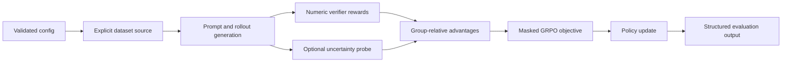

# EAR-GRPO Reasoning

Research code and reproducibility utilities for studying confidence- and
uncertainty-weighted credit assignment in Group Relative Policy Optimization (GRPO).
The repository emphasizes failure detection, negative controls, and a strict separation
between lightweight software verification and paper-result reproduction.

## Associated IEEE research

This repository contains implementation and reproducibility resources associated with:

**When Confidence Proxies Confound Reasoning Complexity: Pitfalls of
Uncertainty-Weighted Credit Assignment in Language Model Reinforcement Learning**<br>
Sham Thakare, Independent Researcher<br>
Submitted to *IEEE Transactions on Artificial Intelligence*, August 2026

The repository contains no manuscript ID, DOI, or IEEE Xplore URL. The work is therefore
described as **submitted**, not accepted or published. See [IEEE alignment](docs/ieee-paper.md)
and [citation metadata](CITATION.cff).

## Scope and current evidence status

The research began by testing Epistemic Advantage Regularization (EAR-GRPO), which
multiplies group-relative advantages by an exponential function of a trajectory-level
uncertainty proxy. Later phases investigated confidence proxies and Consistency-Aware
GRPO (CA-GRPO), including negative controls.

The original public commit was not independently reproducible: the model wrapper had
been ignored by Git, CI referenced a missing dependency file, a five-example synthetic
fallback was indexed as if it were a larger benchmark, and the raw Phase VII validation
artifact referenced by the result ledger was absent. Accordingly:

- historical experiment outputs remain available for auditability;
- they are not advertised here as verified benchmark evidence;
- `results/FINAL_CANONICAL_RESULTS.json` now records the provenance gap;
- deterministic smoke tests validate software behavior only.

This does not assert that the submitted manuscript's findings are false. It states that
the current public artifact cannot regenerate those findings without the missing raw
provenance.

## Method

For rewards \(r_i\) within a rollout group, the GRPO advantage is

\[
A_i = \frac{r_i - \mu_r}{\sigma_r + \epsilon}.
\]

Zero-variance and singleton groups return zero because they contain no relative reward
information. The EAR implementation evaluates the submitted weighting form

\[
\widetilde{A}_i = A_i \exp\left(-\gamma U_i / (\sigma_U + \epsilon)\right).
\]

Constant uncertainty receives a neutral weight rather than division by a small epsilon:
a constant vector cannot rank trajectories. The token-level GRPO objective uses a frozen
rollout policy, clipping, completion/EOS masks, sequence-balanced reduction, and a
non-negative sampled KL estimator. See [methodology](docs/methodology.md).



## Installation

Python 3.10–3.12 is supported. The verified offline path uses PyTorch, NumPy, and PyYAML:

```bash
python -m pip install -e ".[dev]"
python -m pip check
```

Historical Hugging Face experiments additionally require the `research` extra and model
or dataset downloads. They are not part of the lightweight CI gate.

## Quick start

Run the deterministic CPU training smoke test:

```bash
python -m ear_grpo_reasoning.smoke_train --config configs/smoke.yaml
python -m ear_grpo_reasoning.smoke_train --config configs/ear_smoke.yaml
```

Run the deterministic verifier/evaluation smoke test:

```bash
python -m ear_grpo_reasoning.evaluate --config configs/evaluation.yaml
```

These commands write Git-ignored JSON under `results/generated/`. Their output says
`software-verification-only`; neither command reproduces IEEE benchmark numbers.

## Development verification

```bash
ruff check .
ruff format --check .
mypy -p ear_grpo_reasoning
pytest -q
python -c "import ear_grpo_reasoning"
```

CI runs the same lightweight checks on Python 3.10, 3.11, and 3.12. See
[reproduction](docs/reproduction.md) for the clean verification protocol.

## Configuration

- `configs/smoke.yaml`: deterministic offline objective training.
- `configs/ear_smoke.yaml`: deterministic offline EAR-weighted objective training.
- `configs/evaluation.yaml`: deterministic offline verifier evaluation.
- `configs/baseline.yaml`: explicit GRPO research configuration template.
- `configs/ear_grpo.yaml`: explicit EAR-GRPO research configuration template.
- `configs/tier1_dev.yaml` and `configs/tier2_main.yaml`: historical configurations;
  they predate the strict schema and are preserved only for auditability.

Unknown keys and invalid group/rollout relationships fail fast. Every structured output
includes a SHA-256 hash of the fully resolved configuration.

## Repository structure

```text
configs/                         Strict configs plus historical templates
docs/                            Method, architecture, reproduction, IEEE alignment
experiments/                     Historical compute-intensive research scripts
research/                        Historical hypotheses, audits, and claim ledgers
results/                         Provenance status, schema, raw and archived artifacts
src/ear_grpo_reasoning/          Maintained installable Python package
submission/ieee_tai/             Submitted-manuscript package and metadata
tests/                           Offline scientific and regression tests
```

Historical scripts are retained to avoid hiding the research trail. They are not CI
entry points and must not be used to reinstate claims until the provenance requirements
in [results/README.md](results/README.md) are satisfied.

## Evaluation integrity

The maintained evaluation entry point accepts either the labeled built-in smoke fixture
or an explicit JSONL prediction file. It reports metric mean, sample standard deviation,
sample count, seed, model, dataset, split, and configuration hash. The output schema is
[`results/schema.json`](results/schema.json).

## Reproducibility and hardware

The verified smoke path is CPU-only, requires no API key, and downloads no model or
dataset. Full model experiments require substantially more memory, disk, and runtime;
requirements depend on the selected model and are not inferred from the smoke tests.
CUDA can introduce nondeterministic operations; deterministic mode fails instead of
silently falling back when PyTorch cannot provide a deterministic kernel.

## Limitations

- The public artifact lacks the raw Phase VII prompt-level evidence referenced by the
  historical ledger.
- Historical result files mix exploratory phases and generation budgets; they are not
  an active benchmark table.
- The numeric verifier intentionally does not claim general symbolic equivalence.
- The smoke model verifies gradients and masking but is not a language model benchmark.
- Full external-model training and paper-result reproduction require a separately
  restored, provenance-complete experiment bundle.

## Citation

Until a DOI or publication record exists, cite the software using `CITATION.cff`. The
associated submitted manuscript metadata is provided separately in `CITATION.bib` and
does not imply acceptance or publication.

## License and contributing

Code is licensed under the [MIT License](LICENSE). Models, datasets, the IEEE class file,
and manuscript content may have separate terms. Contributions should include tests,
document the evidence scope, and avoid adding generated benchmark outputs without raw
provenance. See [CONTRIBUTING.md](CONTRIBUTING.md).
