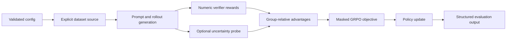

# EAR-GRPO Reasoning

[](https://github.com/shamddd/ear_grpo_reasoning/actions/workflows/ci.yml)

[](LICENSE)

This project investigates whether trajectory-level confidence or uncertainty should
reweight group-relative advantages when post-training language models with Group
Relative Policy Optimization (GRPO). Epistemic Advantage Regularization (EAR) applies an
exponential uncertainty weight to each rollout advantage. The research later broadened
into an adversarial study of whether confidence proxies track errors or merely reasoning
complexity.

The maintained package verifies the EAR/GRPO mathematics, optimization mechanics,
dataset adapter, evaluation schema, and deterministic smoke paths. It does **not**
currently reproduce the manuscript's full historical experiments or reported numbers.

## Associated IEEE research

This repository contains implementation and reproducibility resources associated with:

**When Confidence Proxies Confound Reasoning Complexity: Pitfalls of
Uncertainty-Weighted Credit Assignment in Language Model Reinforcement Learning**<br>
Sham Thakare, Independent Researcher<br>
Submitted to *IEEE Transactions on Artificial Intelligence* on 13 August 2026<br>
Manuscript ID: `TAI-2026-Aug-A-01875`

This identifier is a submission-system manuscript ID, not a DOI. There is no verified
DOI, acceptance notice, publication date, or IEEE Xplore page. The work is therefore
described as **submitted**, not accepted or published. See
[IEEE alignment](docs/ieee-paper.md) and [citation metadata](CITATION.cff).

## Scope and current evidence status

The research began by testing Epistemic Advantage Regularization (EAR-GRPO), which
multiplies group-relative advantages by an exponential function of a trajectory-level
uncertainty proxy. Later phases investigated confidence proxies and Consistency-Aware
GRPO (CA-GRPO), including negative controls.

The original public commit was not independently reproducible: the model wrapper had
been ignored by Git, CI referenced a missing dependency file, a five-example synthetic
fallback was indexed as if it were a larger benchmark, and the raw Phase VII validation
artifact referenced by the result ledger was absent. Accordingly:

- historical experiment outputs remain available for auditability;
- they are not advertised here as verified benchmark evidence;
- `results/FINAL_CANONICAL_RESULTS.json` now records the provenance gap;
- deterministic smoke tests validate software behavior only.

This does not assert that the submitted manuscript's findings are false. It states that
the current public artifact cannot regenerate those findings without the missing raw
provenance.

### Version history

The public `v1.0.0` tag and release are preserved as a historical IEEE submission-artifact
snapshot; the package metadata within that snapshot declared version `0.1.0`. The
maintained package adopts version `1.1.0` to preserve that public history and restore
forward semantic versioning without moving or reusing the existing tag.

## Research findings

- **Hypothesis:** uncertainty-weighted advantages might suppress unreliable positive
  rollouts and stabilize GRPO.
- **Recorded observation:** the archived investigation reports that MC-dropout is
  degenerate for the evaluated zero-dropout architecture and that several internal
  confidence proxies covary with derivation length and arithmetic complexity.
- **Interpretation:** confidence weighting can penalize difficult or multi-step reasoning
  rather than isolate erroneous reasoning, so offline predictive value alone is not
  evidence of useful online credit assignment.
- **Limitation:** the raw Phase VII artifact needed to independently regenerate the
  manuscript tables is absent. These observations are therefore historical research
  findings, not newly reproduced results from this checkout.

## Method

For rewards \(r_i\) within a rollout group, the GRPO advantage is

\[
A_i = \frac{r_i - \mu_r}{\sigma_r + \epsilon}.
\]

Zero-variance and singleton groups return zero because they contain no relative reward
information. The EAR implementation evaluates the submitted weighting form

\[
\widetilde{A}_i = A_i \exp\left(-\gamma U_i / (\sigma_U + \epsilon)\right).
\]

The implementation evaluates this expression literally, including when uncertainty is
constant. The token-level GRPO objective uses frozen rollout probabilities, clipping,
completion/EOS masks, sequence-balanced reduction, and a documented non-negative
sampled KL estimator. See [methodology](docs/methodology.md).



## Installation

Python 3.10–3.12 is supported. The verified offline path uses PyTorch, NumPy, and PyYAML:

```bash
python -m pip install -e ".[dev]"
python -m pip check
```

Historical Hugging Face experiments additionally require the `research` extra and model
or dataset downloads. They are not part of the lightweight CI gate.

## Quick start

Run the deterministic CPU training smoke test:

```bash
python -m ear_grpo_reasoning.smoke_train --config configs/smoke.yaml
python -m ear_grpo_reasoning.smoke_train --config configs/ear_smoke.yaml
```

Run the deterministic verifier/evaluation smoke test:

```bash
python -m ear_grpo_reasoning.evaluate --config configs/evaluation.yaml
```

These commands write Git-ignored JSON under `results/generated/`. Their output says
`software-verification-only`; neither command reproduces IEEE benchmark numbers.

## Reproducibility levels

- **Level A — software reproducibility:** verified installation, tests, GRPO/EAR smoke
  paths, evaluation schema, dataset adapter, and tiny-model integration.
- **Level B — experimental reproduction:** requires immutable model and dataset
  revisions, seeds, hyperparameters, hardware/software inventory, checkpoints, and raw
  logs. Those inputs are incomplete for the historical paper experiments.
- **Level C — paper-number reproduction:** not currently claimable because the original
  provenance is incomplete and the full experiments have not been rerun.

The detailed gate and manifest requirements are in [docs/reproduction.md](docs/reproduction.md).

## Development verification

```bash
ruff check .
ruff format --check .
mypy -p ear_grpo_reasoning
pytest -q
python -c "import ear_grpo_reasoning"
```

CI installs, tests, and runs the smoke paths on Python 3.10, 3.11, and 3.12. Static type
checking runs once against the minimum supported Python 3.10 grammar. See
[reproduction](docs/reproduction.md) for the clean verification protocol.

## Configuration

- `configs/smoke.yaml`: deterministic offline objective training.
- `configs/ear_smoke.yaml`: deterministic offline EAR-weighted objective training.
- `configs/evaluation.yaml`: deterministic offline verifier evaluation.
- `configs/baseline.yaml`: GRPO research template; model/data revisions must be filled.
- `configs/ear_grpo.yaml`: EAR-GRPO research template; revisions must be filled.
- `configs/tier1_dev.yaml` and `configs/tier2_main.yaml`: historical configurations;
  they predate the strict schema and are preserved only for auditability.

Unknown keys and invalid group/rollout relationships fail fast. External adapters accept
immutable model and dataset revisions, and every structured output includes a SHA-256
hash of the fully resolved configuration.

## Repository structure

```text
configs/                         Strict configs plus historical templates
docs/                            Method, architecture, reproduction, IEEE alignment
experiments/                     Historical compute-intensive research scripts
research/                        Historical hypotheses, audits, and claim ledgers
results/                         Provenance status, schema, raw and archived artifacts
src/ear_grpo_reasoning/          Maintained installable Python package
submission/ieee_tai/             Submitted-manuscript package and metadata
tests/                           Offline scientific and regression tests
```

Historical scripts are retained to avoid hiding the research trail. They are not CI
entry points and must not be used to reinstate claims until the provenance requirements
in [results/README.md](results/README.md) are satisfied.

## Research engineering contributions

Sham Thakare — Independent Researcher

- EAR uncertainty-weighted advantage implementation and degeneracy analysis
- GRPO clipped-objective and reference-policy pipeline
- MC-dropout uncertainty probing with zero-dropout validation
- deterministic configuration, seeding, and structured evaluation
- explicit benchmark adapters without silent synthetic fallback
- negative-control and provenance-oriented research validation

## Evaluation integrity

The maintained evaluation entry point accepts either the labeled built-in smoke fixture
or an explicit JSONL prediction file. It reports metric mean, sample standard deviation,
sample count, seed, model, dataset, split, and configuration hash. The output schema is
[`results/schema.json`](results/schema.json).

## Reproducibility and hardware

The verified smoke path is CPU-only, requires no API key, and downloads no model or
dataset. Full model experiments require substantially more memory, disk, and runtime;
requirements depend on the selected model and are not inferred from the smoke tests.
CUDA can introduce nondeterministic operations; deterministic mode fails instead of
silently falling back when PyTorch cannot provide a deterministic kernel.

## Limitations

- The public artifact lacks the raw Phase VII prompt-level evidence referenced by the
  historical ledger.
- Historical result files mix exploratory phases and generation budgets; they are not
  an active benchmark table.
- The numeric verifier intentionally does not claim general symbolic equivalence.
- The smoke model verifies gradients and masking but is not a language model benchmark.
- Full external-model training and paper-result reproduction require a separately
  restored, provenance-complete experiment bundle.

## Citation

Until a DOI or publication record exists, cite the software using `CITATION.cff`. The
associated manuscript was submitted on 13 August 2026 under manuscript ID
`TAI-2026-Aug-A-01875`; `CITATION.bib` records that submission metadata without implying
acceptance or publication.

## License and contributing

Code is licensed under the [MIT License](LICENSE). Models, datasets, the IEEE class file,
and manuscript content may have separate terms. Contributions should include tests,
document the evidence scope, and avoid adding generated benchmark outputs without raw
provenance. See [CONTRIBUTING.md](CONTRIBUTING.md).
