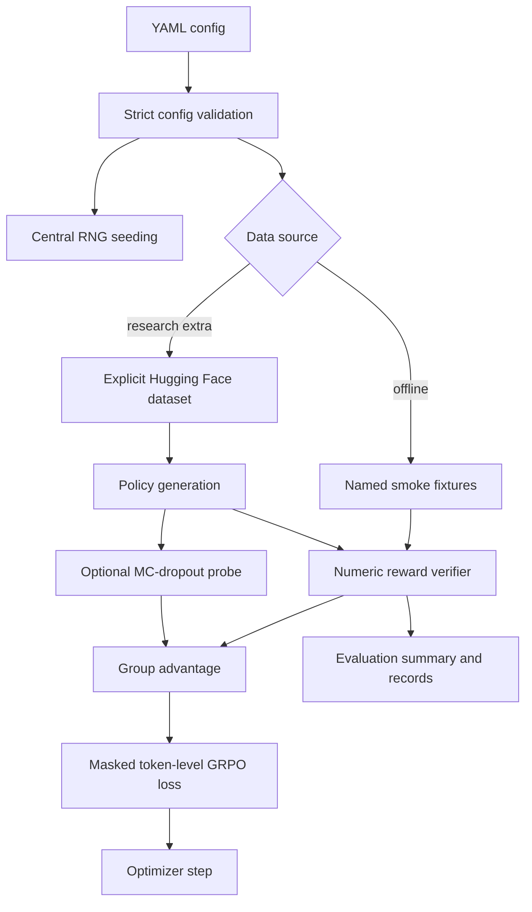

# Software architecture

The maintained package is deliberately small. Historical experiment runners remain
separate because their evidence provenance is incomplete.

Key boundaries:

- `algorithms/` contains pure tensor operations with no model download side effects.
- `models/` lazily imports Hugging Face dependencies and detects degenerate MC dropout.
- `data/` never substitutes synthetic fixtures for a named external benchmark.
- `evaluate.py` evaluates existing predictions; it does not hide model generation.
- `smoke_train.py` exercises gradients with a tiny local model and clearly labels its
  output as software verification.
- `results/generated/` is ignored; committed results require provenance review.
